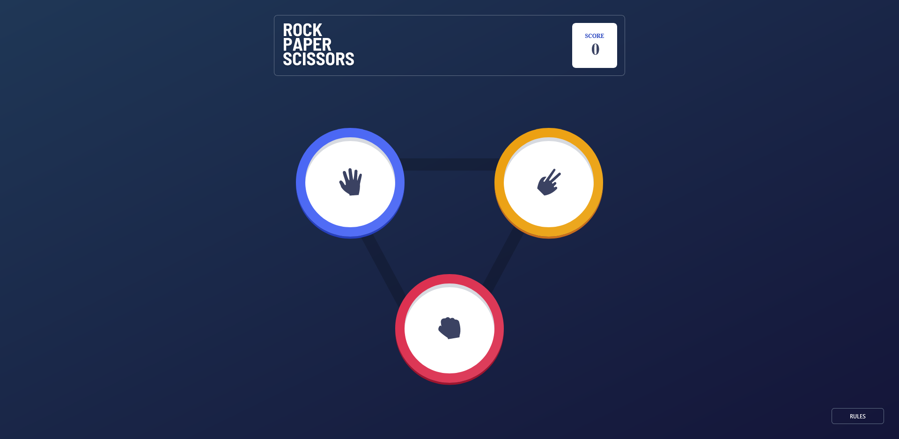

# Frontend Mentor - Rock, Paper, Scissors solution

This is a solution to the [Rock, Paper, Scissors challenge on Frontend Mentor](https://www.frontendmentor.io/challenges/rock-paper-scissors-game-pTgwgvgH).

## Table of contents

- [Frontend Mentor - Rock, Paper, Scissors solution](#frontend-mentor---rock-paper-scissors-solution)
  - [Table of contents](#table-of-contents)
  - [Overview](#overview)
    - [The challenge](#the-challenge)
    - [Screenshot](#screenshot)
    - [Built with](#built-with)

## Overview

### The challenge

Users should be able to:

- View the optimal layout for the game depending on their device's screen size
- Play Rock, Paper, Scissors against the computer
- Maintain the state of the score after refreshing the browser _(optional)_

### Screenshot

### Built with

- [Vite](https://vitejs.dev/)
- [React](https://reactjs.org/)
- [TailwindCss](https://tailwindcss.com/)
- [headlessUI](https://headlessui.com/)
